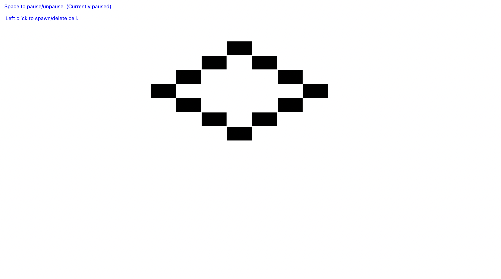

# Conways.

Simple conways game of life using uibs inf100 graphics library.
Small and fun.

## About the Game

This is an implementation of Conway's Game of Life, a cellular automaton devised by the mathematician John Horton Conway. The game is a zero-player game, meaning that its evolution is determined by its initial state, requiring no further input. One interacts with the Game of Life by creating an initial configuration and observing how it evolves.

### Rules

1. **Underpopulation**: Any live cell with fewer than two live neighbours dies.
2. **Survival**: Any live cell with two or three live neighbours lives on to the next generation.
3. **Overpopulation**: Any live cell with more than three live neighbours dies.
4. **Reproduction**: Any dead cell with exactly three live neighbours becomes a live cell.

### Objective

The objective of the game is to observe the patterns that emerge from the initial configuration of cells. These patterns can range from static structures to oscillators and spaceships that move across the grid.

## Graphics Library

The game uses the UIB INF100 graphics library to render the cells and their evolution over time. This library provides a simple interface for creating graphical applications, making it ideal for visualizing the Game of Life.

## Controls

- **Space**: Pause/Resume the game.
- **R**: Reset the game.
- **Mouse Click**: Toggle the state of a cell (on/off).

## Installation

"""
This game has been tested on both Windows and Mac operating systems.
It appears to be working on both platforms with the newest version (as of 12.11.2024) of the UIB INF 100 graphics library.
"""

```sh
pip install uib-inf100-graphics
```

## Running the Game

To start the game, run:

```sh
python main.py
```

## Screenshots

Some screenshots showing the first three iterations of an initial configuration.



